# ACIT2520_ReminderApp
## Term Project for Web Dev

Welcome to our reminders project

For start our project, you need to type npm install in the terminal and go to URL localhost:3001

You can find account email and account password in the database.js

## Basic function(edit update delete and create)
To edit a reminder, click the View button that is to the right of each individual reminder. 

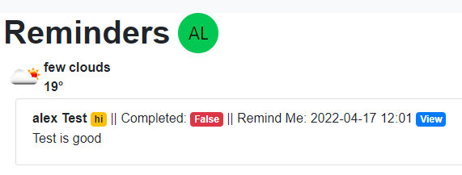

Here, you can add or delete Subtasks and Tags, as well as further edit the reminder. This can be done by clicking the Edit button, where you can now choose to edit the reminder Title, Description, Date, or Completion by clicking the Update button, or delete the reminder by clicking the Delete button.

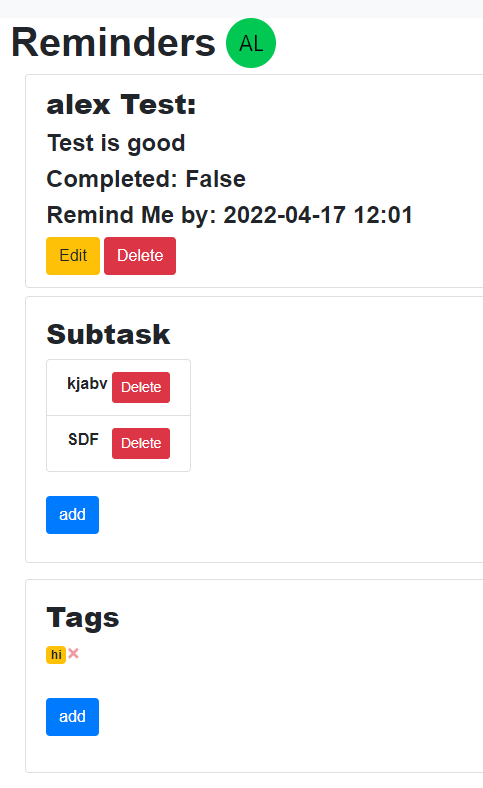
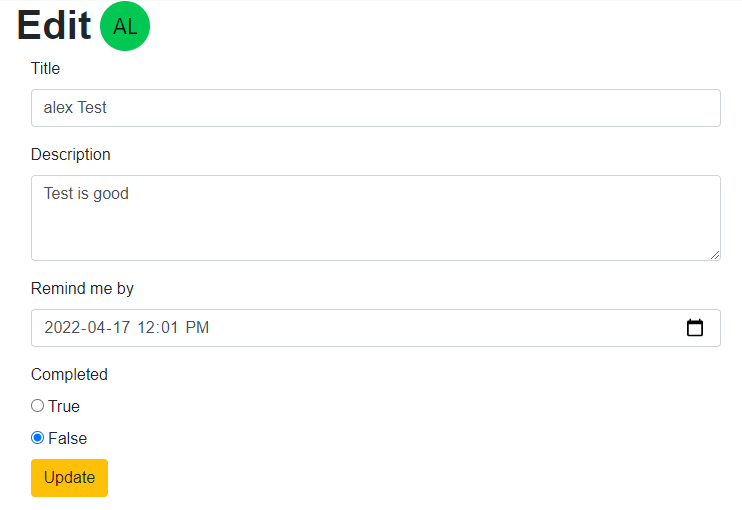

To create a new reminder, click the Create button on the navigation bar. You can now input the Title, Description, Tag (which needs to be a whole word), and choose a Date. Once done, click Submit.

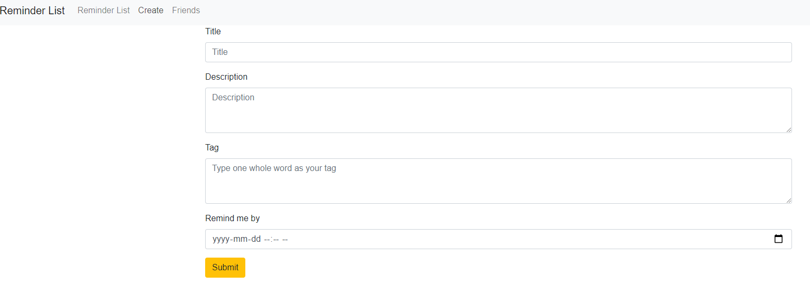

## Add friends function
You can click the friends button in the navigation bar and type your friend's email adding your friends
Also, your friends will automatically add you as well.
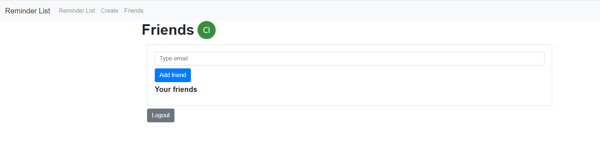

You also can copy your friends remiders to your remiders as well. Thoes reminders will update when your friend update.

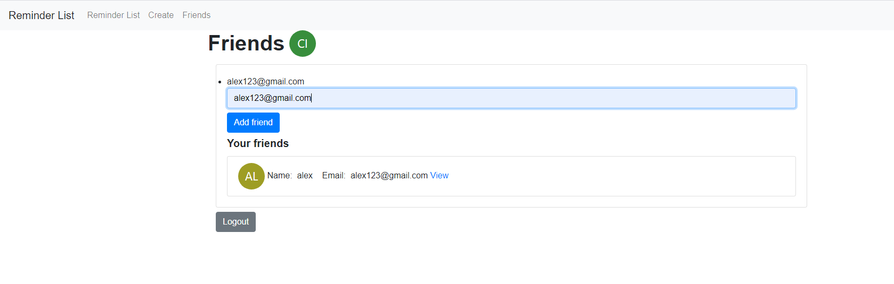

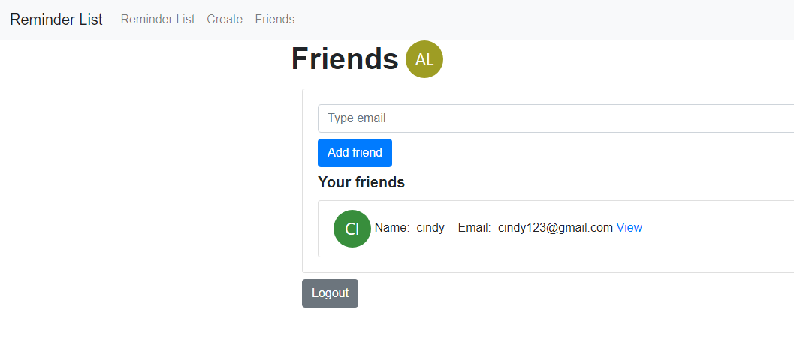

## Tags
You can use tags to highlight the keywords for each of your reminders! 

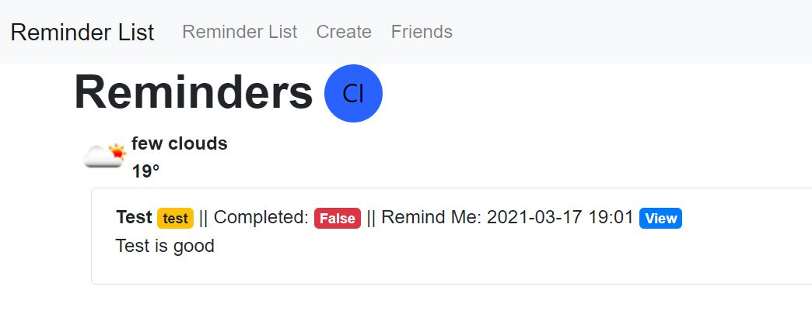

These will show up on your friends reminders' list on your homepage so you can see their tags too. 

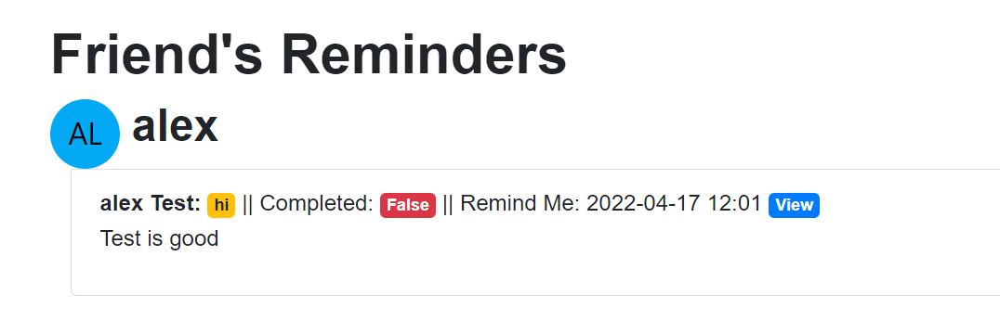

Additionally, you can delete and add tags when you click on any of your own reminders. 

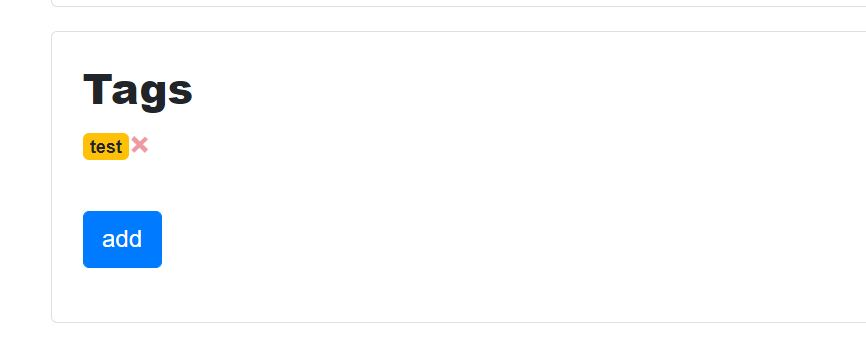

Your tags need be typed in as one word per tag entry. They will show up within a yellow rectangle with rounded edges. 

## Subtasks
When a reminder is created, at first that reminder will not have a subtask. Subtasks can be added when you go to the single reminders page and add subtasks manually. When the user presses "add" underneath Subtask, a new box will show and the user will be able to type their subtask into the box. The user will then press "Submit" to add the subtask to the list of subtasks. These subtasks will only be shown when the user accesses the single reminder page. Subtasks can be deleted when the "Delete" button is clicked.

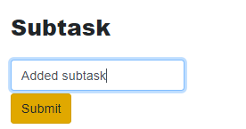

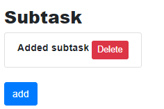 

## Weather
You can see current weather state on your home page. For technical reason, the website will only show Vancouver's weather.

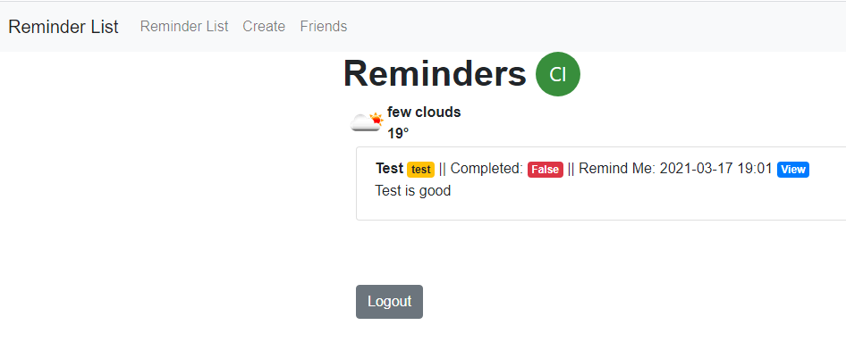
